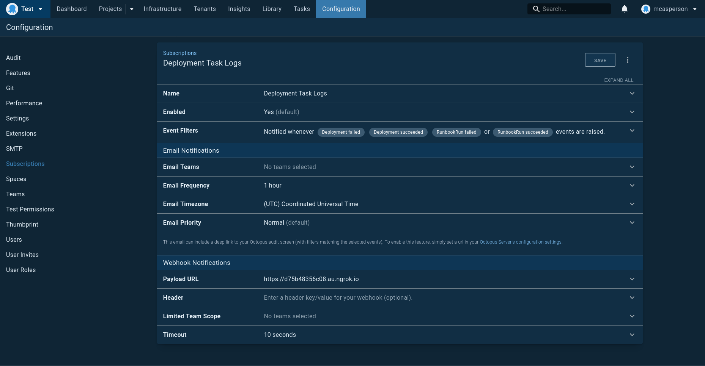

This Python application provides a web server that responds to [Octopus subscriptions](https://octopus.com/docs/administration/managing-infrastructure/subscriptions)
like `Deployment succeeded` and `Deployment failed` and writes the associated task logs to disk.

This project is intended to provide the glue between am external logging system and Octopus task logs. By having an
external logging agent watch for new log files, Octopus task logs can be ingested into almost any external logging
solution.

# Usage

* `pip install -r requirements.txt`
* `python main.py --octopusUrl https://yourinstance.octopus.app --octopusApiKey API-YOURKEYGOESHERE`

# Example Subscription Configuration

